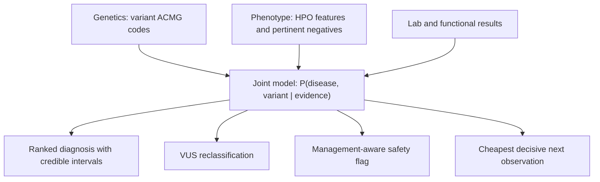

<div align="center">

# DISCERN

**A coupled disease and variant engine for inherited bleeding and platelet disorders:
differential diagnosis, misdiagnosis prevention, and VUS resolution in a single model.**

[](https://github.com/ahmedanees-m/discern/actions/workflows/ci.yml)
[](https://codecov.io/gh/ahmedanees-m/discern)
[](https://www.python.org)
[](https://github.com/astral-sh/ruff)
[](LICENSE)
[](#project-status)
[](tests)

Built on the reused OmniVar Navigator foundation (rule engine, evidence adapters, equity
layer, audit, and infrastructure).

</div>

## Overview

Inherited bleeding disorders are frequently misdiagnosed because distinct diseases
converge on the same clinical picture through shared molecular pathways. The mistakes are
concrete and treatment changing: Glanzmann thrombasthenia versus LAD-III (which needs a
stem-cell transplant); type 2B von Willebrand disease versus platelet-type VWD (opposite
treatments, where DDAVP can harm 2B); Bernard-Soulier mistaken for ITP (leading to
needless steroids or splenectomy); Factor XIII deficiency missed until a fatal brain bleed.
More than 60 percent of variants in these genes are classified as uncertain (VUS), and the
settings that most need disambiguation have the least access to specialist labs.

DISCERN treats diagnosis, misdiagnosis safety, and VUS resolution as three readouts of one
model. It computes a single joint posterior over disease and variant, then reports the
most probable explanation, what would change it, and the cheapest observation that gets
there.

## The core idea

The criterion PP4 ("this phenotype is specific for one disease") structurally requires a
disease model. Generic variant classifiers cannot compute it properly because they do not
model the disease. DISCERN can, because the disease-discrimination model is exactly what
PP4 needs. So the disease-reasoning layer is also a VUS-resolution engine: the same
phenotype that ranks the diagnosis supplies a calibrated PP4, and the same test that
separates two diseases usually supplies the functional evidence that upgrades the variant.

## What makes it novel

| Contribution | Description |
|---|---|
| Coupled joint model | One posterior `P(D, V given E)`: phenotype informs the disease, variant-intrinsic genetics inform the variant, functional evidence informs both. PP4 is expressed as the disease-to-variant coupling, not as an added code. |
| VCEP anchored, counted once | Each ACMG code is routed to exactly one factor. The ClinGen VCEP specification is decomposed per code rather than consumed as a bottom-line label, so no evidence is double counted. A reconstruction test verifies this. |
| Management-aware safety flag | Fires on treatment danger, not on the size of the posterior gap. A small probability of a treatment-changing competitor fires (DDAVP and 2B, splenectomy and BSS, HSCT and LAD-III). |
| Cheapest decisive next observation | Ranks lab, functional, segregation, and phasing steps by information gain over the joint posterior, and works on partial inputs. |
| Calibrated abstention | Sparse likelihood ratios produce wide credible intervals, so the engine declines to call when the data cannot support it. The headline safety metric is the confident-and-wrong rate. |

## How it works



Each evidence stream enters the model exactly once. The cluster is small, so the joint is
computed by exact enumeration over disease and variant states. When the data are sparse,
the engine abstains and returns the deciding observation instead.

## The six discrimination clusters

| Cluster | Look-alike diseases | Deciding observation | Misdiagnosis harm |
|---|---|---|---|
| Integrin | Glanzmann, LAD-III, RASGRP2, LAD-I | leukocytosis, integrin activation | LAD-III and LAD-I need HSCT |
| VWF and GPIb | 2B VWD, platelet-type VWD, 2A VWD | RIPA mixing (plasma vs platelet) | DDAVP harms 2B; opposite treatment |
| Macrothrombocytopenia | Bernard-Soulier, MYH9, vs ITP | blood smear, CD42 flow | avoids steroids and splenectomy |
| Granule | HPS, Chediak-Higashi, Gray platelet | EM, smear, HLH workup | Chediak risks HLH (HSCT) |
| Thrombocytopenia with leukaemia risk | RUNX1, ETV6, ANKRD26 | germline panel, pedigree | surveillance and donor selection |
| Coagulation factor | F8, F9, F11, F13, fibrinogen | factor assays | Factor XIII miss risks brain bleed |

Every likelihood ratio is linked to a source PMID and a sample size, so the knowledge base
is versioned and citable.

## Inputs and outputs

Input: a variant (gene plus applied ACMG codes), clinical features (HPO terms, present and
explicitly absent), and lab or functional results. Any subset is accepted (partial-input
mode).

Output (`DxRecommendation`): a ranked diagnosis with credible intervals, the measured VUS
reclassification, management-aware safety flags, the cheapest decisive next observation, a
templated explanation, and a full audit trail.

Worked examples (actual engine output):

* Glanzmann vs LAD-III, ITGB3 VUS with recurrent infections. Leading: LAD-III at 73 percent
  (95 percent CI 55 to 91). Flag: if Glanzmann instead, management changes from HSCT to
  antifibrinolytics. Cheapest next step: white cell count for leukocytosis.
* 2B vs platelet-type VWD, GP1BA with platelet-origin RIPA and planned DDAVP. Leading:
  platelet-type VWD at 84 percent. Hard stop: DDAVP is contraindicated if type 2B
  (probability 0.14); resolve first. Cheapest next step: targeted GP1BA versus VWF
  sequencing.

## Quick start

```bash
conda env create -f environment.yml        # or: pip install -e ".[dev]"
make test                                   # ruff and pytest (104 tests)
```

```python
from jointdx.factorgraph import Evidence
from jointdx.orchestrate import diagnose
from core.dx_schemas import Feature, FeatureKind

ev = Evidence(variant_gene="GP1BA",
              clinical=[Feature("ripa_mixing_platelet_origin", FeatureKind.LAB, True)])
rec = diagnose(ev, planned_tx="ddavp")
print(rec.posterior.leading, rec.explanation)   # platelet-type VWD plus a DDAVP hard stop
```

API: `POST /diagnose` (FastAPI). Deploy on the VM with
`docker compose -f deploy/compose.vm.yml up -d`.

## Repository structure

```
core/         shared schemas plus the DISCERN data model (dx_schemas.py)
rules/        ACMG point engine, posterior bridge, code parser
rules/vcep/   machine-readable VCEP specs plus the per-code partition map
adapters/     gnomAD, ClinVar, in-silico, splice, autoPVS1, MAVE, phenotype, prioritizer
evidence/     genetic (variant-intrinsic), phenotype LR with negatives, lab and functional
diseases/     disease ontology and the six discrimination clusters (clusters/*.yaml)
jointdx/      the joint model: factorgraph, infer, uncertainty, abstain, orchestrate, explain
safety/       management-aware misdiagnosis and treatment-safety interlock
nextobs/      cheapest decisive next observation, partial-input mode, what-if
triage/       scientist-facing VUS triage (which variant to assay next)
intake/       free-text to HPO with pertinent-negative capture
equity/       ancestry reliability, equitable routing, dashboards
learn/        outcome store and auditable prior updates
sim/  eval/   simulator and validation harnesses (reader study, VUS reclass, calibration)
llm/  api/    cloud Nemotron gateway and the FastAPI engine endpoints
deploy/ docker/ data/ figures/ manuscript/ tests/   deployment, images, data, docs, tests
```

## Validation status

* Gate G1: the reused rule engine reproduces ClinGen eRepo at 94.9 percent exact and 99.9
  percent within-one-bin concordance on 12,499 records.
* Gate G3 (the circularity fix): re-adding the VCEP bundled codes (PP4, PS3, PP1, PM3)
  produces an identical joint posterior with no inflation. Verified in
  `tests/test_vcep_reconstruction.py`.
* Flagship discrimination (Glanzmann versus LAD-III, 2B versus platelet-type VWD), the
  safety interlocks, and VUS reclassification are unit tested. The validation harnesses
  (reader study, VUS reclassification versus 3-star truth, misdiagnosis rescue, and
  calibration) are built; the pre-registered reader study and the Glanzmann cohort run are
  future work.

## Safety

DISCERN abstains when sparse likelihood ratios cannot support a call, reports the
confident-and-wrong rate, and never auto-diagnoses or auto-treats. It recommends, with
human sign-off and a full audit trail. No real patient data appears in any public artifact.

## Project status

DISCERN phases 0 through 10 are code complete and unit tested on the reused OmniVar
foundation. Remaining work is external: the pre-registered reader study, the South Indian
Glanzmann cohort run, extraction of the exact per-code VCEP strength tables (currently
documented placeholders), and the web interface. See
[docs/DISCERN_Execution_Summary.md](docs/DISCERN_Execution_Summary.md) for the full
per-phase log.

## License and citation

Released under the [MIT License](LICENSE). Reference datasets retain their upstream
licenses. Cite via [CITATION.cff](CITATION.cff). All sources were independently verified;
see [docs/DISCERN_Source_Verification_Report.md](docs/DISCERN_Source_Verification_Report.md).

Author: Anees Ahmed Mahaboob Ali ([@ahmedanees-m](https://github.com/ahmedanees-m)).
