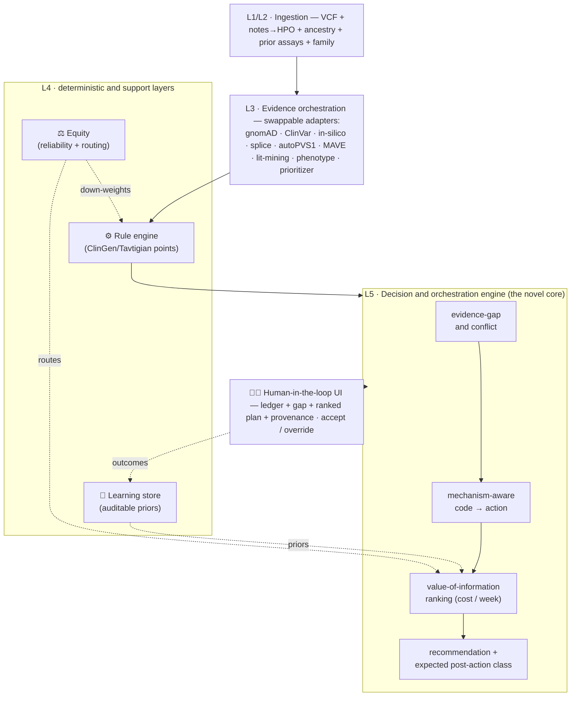
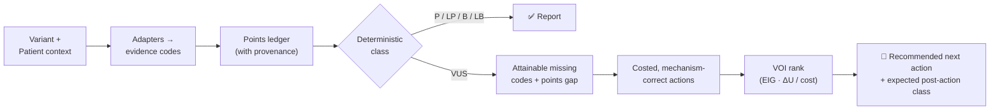

<div align="center">

# 🧬 OmniVar Navigator

**A rule-grounded, value-of-information clinical decision-support engine that turns a
VUS from a dead-end into a costed, auditable resolution path.**

[](https://github.com/ahmedanees-m/omnivar-navigator/actions/workflows/ci.yml)
[](https://codecov.io/gh/ahmedanees-m/omnivar-navigator)
[](https://www.python.org)
[](https://github.com/astral-sh/ruff)
[](https://github.com/psf/black)
[](LICENSE)
[](#project-status)
[](tests)

*Priority domain: inherited bleeding & platelet disorders · epilepsy and cancer-predisposition packs follow.*

</div>

---

## What it is

Every existing variant tool — in-silico predictors (AlphaMissense, REVEL), prioritizers
(Exomiser, AI-MARRVEL), single-criterion automators (autoPVS1, AutoPM3), and full
classifiers — **classifies or ranks from the evidence already available.** None answers
the question a stuck case actually poses:

> *For **this** unsolved patient and **this** uncertain variant, what is the single most
> informative, cost-effective, ancestry-fair **next action** — and what would it do to the
> classification?*

OmniVar Navigator answers exactly that. It is **decision support, not an autonomous
classifier**: a deterministic rule engine computes every verdict from a ClinGen/Tavtigian
points ledger, while a language model only reads, retrieves, and explains — **it never
produces the classification.**

The key reframing: under the ClinGen/Tavtigian point system, **a VUS is formally an
evidence deficit** — its accumulated points sit in the uncertain band, short of a
threshold either way. Resolving it means *acquiring the evidence that closes the gap*. The
engine treats this as a **Bayesian sequential decision problem under budget**.

## Why it's novel

| Contribution | What it means |
|---|---|
| 🎯 **Value-of-information over ACMG codes** | Ranks orderable lab actions by expected information gain (and probability of reaching a reportable call) **per dollar and per week** — not just "which test is most sensitive." |
| 🔒 **Rule-grounded (neurosymbolic) safety** | The classification is computed deterministically from points; the LLM only proposes/explains. Directly answers the documented LLM-hallucination problem in variant interpretation. |
| ⚖️ **Built-in equity mechanism** | Non-European patients get a VUS 1.5–2× more often, driven by ancestry-biased allele-frequency (PM2) and in-silico (PP3) evidence. The engine down-weights that evidence's reliability and **routes to ancestry-robust actions** (functional / segregation). |
| 🔁 **Verifiable learning loop** | Realized outcomes update only the cost/yield **priors** (Beta-Bernoulli), each update attributable to specific cases — the verdict logic is never opaquely retrained. |
| 🧩 **Mechanism-aware routing** | The same code (PS3) maps to different assays by disease mechanism — e.g. it **refuses** to order expression flow cytometry for an *activation*-defect gene (FERMT3/LAD-III) and routes to activation assays instead. |

## How it works

### Layered architecture



### Per-case decision flow



## Inputs & outputs

| | Detail |
|---|---|
| **Input** | A `Variant` (gene, HGVS, coordinates) + `PatientContext` (HPO terms, inferred ancestry, parents/family availability, prior assay results, sex). At case level: a VCF + clinical notes. |
| **Output** | A `Recommendation`: current class + posterior, the points gap, a **ranked list of next actions** — each with cost, turnaround, expected information gain, decision utility, and the **expected post-action classification** — a cost–EIG Pareto frontier, a templated explanation, and a full audit trail. |

**Worked example (runs end-to-end on real data):**

> Real `F8` p.Arg612Cys → ClinVar **PS1** (Strong) → **+4 points → VUS** →
> recommends the mechanism-correct **factor activity assay** (~\$250, ~5 days) →
> expected **PS3** → posterior **0.97** → **Likely Pathogenic**, with the X-linked
> hemizygote PS4 note.

## Quick start

```bash
# Dev (laptop): pure-Python core + unit tests on tiny fixtures
conda env create -f environment.yml      # or: pip install -e ".[dev]"
conda activate omnivar-nav
make test                                 # ruff + pytest (76 tests)

# Try the engine
python -m sim.odyssey_sim                 # VOI vs greedy/random/fixed policies
python -m eval.validate_erepo data/raw/erepo/erepo_classifications.tab   # Gate G1 (needs data)

# Production (VM): Docker-only — the whole stack
docker compose -f deploy/compose.vm.yml up -d --build
```

The Python API mirrors the service contract:

```python
from api.main import handle_recommend
handle_recommend({
    "gene": "ITGB3", "codes": ["PM2", "PP3"],
    "mechanism": "integrin_expression", "domain": "bleeding",
})
# -> {current_class: "VUS", actions: [...], pareto_frontier: [...], explanation: "...", ...}
```

## Repository structure

```
omnivar-navigator/
├── core/                  # shared schemas, the EvidenceAdapter contract, hash-chained audit ledger
│   ├── schemas.py         #   Variant, PatientContext, EvidenceContribution, PointsLedger, Action, ...
│   ├── adapter.py         #   EvidenceAdapter ABC — the swappability contract
│   └── audit.py           #   immutable, tamper-evident reasoning trace
├── rules/                 # deterministic classification (verdicts never come from an LLM)
│   ├── point_engine.py    #   points → class (Tavtigian bands, BA1 pre-filter)
│   ├── posterior.py       #   points → posterior probability (OddsPath = 350^(C/8))
│   ├── acmg_codes.py      #   parse ACMG code strings (CODE / CODE_Strength) → signed points
│   ├── vcep_loader.py     #   gene-specific VCEP specs (AF thresholds, mechanism, inheritance)
│   └── specs/             #   base_acmg.yaml, F8.yaml (GN071), SCN1A.yaml, BRCA1.yaml
├── adapters/              # one per evidence code/group — "sources" in action (all swappable)
│   ├── gnomad.py          #   PM2/BS1/BA1  (live gnomAD v4 GraphQL API)
│   ├── clinvar.py         #   PS1/PM5      (index built from kept variant_summary)
│   ├── insilico.py        #   PP3/BP4      (calibrated Pejaver-2022 REVEL thresholds)
│   ├── splice.py          #   PP3/BP4/BP7 + RNA-resolvable flag  (Pangolin)
│   ├── autopvs1.py        #   PVS1         (ClinGen SVI null-variant tree)
│   ├── mave.py            #   PS3/BS3      (Brnich-2020 OddsPath calibration)
│   ├── litmine_pm3.py     #   PM3/PS4      (AutoPM3 + RAG; LLM proposes WITH citations)
│   ├── phenotype.py       #   PP4          (HPO Resnik / best-match-average)
│   └── prioritizer.py     #   candidate belief state (Exomiser / AI-MARRVEL)
├── engine/                # the novel core
│   ├── gap.py             #   evidence-gap & conflict analysis; recessive/X-linked
│   ├── action_map.py      #   mechanism-aware code → action mapping
│   ├── voi.py             #   value-of-information (EIG + ΔU, Pareto, risk gate, lookahead)
│   ├── recommend.py       #   recommendation assembly + templated explanation + audit
│   ├── case_policy.py     #   whole-odyssey routing (variant vs modality; stop/wait/matchmake)
│   └── action_catalog/    #   bleeding.yaml · epilepsy.yaml · cancer.yaml (mechanism-keyed)
├── equity/                # ancestry inference · reliability down-weighting · routing · dashboards
├── learn/                 # outcome store + Beta-Bernoulli prior updates (verdict never retrained)
├── sim/                   # parametric odyssey simulator + baseline policies
├── eval/                  # ablation · calibration (ECE) · equity-gap · retrospective · stats · G1
├── llm/                   # gateway (cloud Nemotron, OpenAI-compatible) + RAG — soft tasks only
├── api/                   # FastAPI engine endpoints: /classify /recommend /case
├── deploy/                # compose.vm.yml · Caddyfile (TLS+auth) · remote.py (SSH/SFTP, env secrets)
├── docker/                # Dockerfile.{api,worker,tools}  (Docker-only on the VM)
├── data/                  # source download/cache scripts + manifest.json (versions, checksums)
├── figures/               # programmatic, regenerable manuscript figures (300 dpi)
├── manuscript/            # outline + claims-map (every claim → evidence → code)
├── docs/                  # concept brief, detailed execution plan, Phase-2 design, topology, security
└── tests/                 # 76 unit tests (fast, no network/heavy deps)
```

## Validation status

- **Gate G1 — rule engine reproduces ClinGen eRepo:** ✅ **94.9% exact / 99.9%
  within-one-bin** concordance on all 12,499 expert classifications (`eval/validate_erepo.py`).
- **Simulator (honest, not overfit):** VOI beats the naive random baseline (cheaper +
  more accurate) and uses no more tests than greedy; graceful-degradation is cheapest.
  VOI does **not** dominate a strong *cost-aware* greedy on a homogeneous cohort — an
  expected negative we report rather than hide. The simulator also surfaced and fixed two
  real engine bugs.
- **Domain-agnosticism:** the same engine routes epilepsy → patch-clamp and cancer → MAVE
  with new packs only (no core change) — unit-tested.

> Validation harnesses (ablation, calibration, equity-gap, retrospective journeys) are
> built; real-cohort and managed-access (Solve-RD/UDN) runs are pre-registered future work.

## Reproducibility & safety

- **Pinned & containerized** — `environment.yml` + Dockerfiles + `data/manifest.json`
  (source versions/checksums) + a seeded simulator. Every source URL/DOI was independently
  re-verified (see `docs/OmniVar_Navigator_Source_Verification_Report.md`).
- **Docker-only on the server**; secrets read from the environment, never committed.
- **No real patient data** in the repo or any public/hosted artifact; the public demo runs
  on synthetic + public data only. This stays decision support — human sign-off required.
- **Compute topology:** laptop = code + tests; VM = all heavy work + hosting; cloud Nemotron
  for soft LLM tasks; data on both, synced via SFTP. See `docs/COMPUTE_TOPOLOGY.md`.

## Project status

All nine planned phases are **code-complete and unit-tested** (foundations, evidence
adapters, the decision core, equity, whole-odyssey, learning loop, validation harnesses,
domain packs, and the deployment/release artifacts). What remains is **external
dependencies, not missing code** — building the external-tool images on the VM, the web UI
front-end, the headline real-cohort ablation run, and extracting the exact F8 GN071
allele-frequency thresholds (currently clearly-marked placeholders). See
[`docs/Omnivar_Navigator_Execution_Summary.md`](docs/Omnivar_Navigator_Execution_Summary.md)
for the full per-phase log.

## License & citation

Code is released under the [MIT License](LICENSE). Reference datasets retain their own
upstream licenses (see `data/manifest.json`). If you use OmniVar Navigator, please cite it
via [`CITATION.cff`](CITATION.cff).

**Author:** Anees Ahmed Mahaboob Ali ([@ahmedanees-m](https://github.com/ahmedanees-m))
