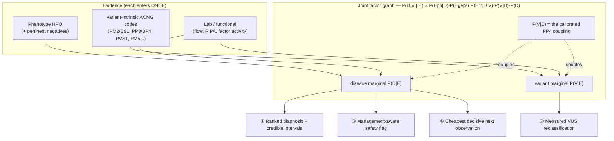
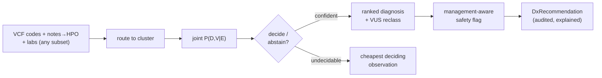

<div align="center">

# 🩸 DISCERN

**A coupled disease × variant engine that decodes genetic overlap in inherited bleeding &
platelet disorders — diagnosis, misdiagnosis-prevention, and VUS resolution in one pass.**

[](https://github.com/ahmedanees-m/omnivar-navigator/actions/workflows/ci.yml)
[](https://codecov.io/gh/ahmedanees-m/omnivar-navigator)
[](https://www.python.org)
[](https://github.com/astral-sh/ruff)
[](https://github.com/psf/black)
[](LICENSE)
[](#project-status)
[](tests)

*Built on the reused [OmniVar Navigator](docs/OmniVar_Navigator_Detailed_Execution_Plan.md) foundation (rule engine, adapters, equity, audit, infra).*

</div>

---

## The core idea (read this first)

Diagnosis, misdiagnosis, and VUS resolution are **not three features — they are three
readouts of one engine**, because of a single fact:

> **PP4 — "this phenotype is specific for one disease" — structurally requires a disease
> model.** Generic variant classifiers (Varsome, Franklin, AlphaMissense) cannot compute
> it properly because they do not model the disease. DISCERN can, because the
> disease-discrimination model **is** the thing PP4 needs.

So the disease-reasoning layer is **also** a VUS-resolution engine. DISCERN computes one
**joint posterior over (disease, variant)** and answers one question with three faces:
***what is the most probable explanation, what would change it, and what is the cheapest
observation that gets there?***

## Why it matters

Inherited bleeding disorders are under-recognised and **frequently misdiagnosed because
distinct diseases converge on the same phenotype through shared pathways** — and the harm
is concrete and treatment-changing:

| Look-alikes | Why it's dangerous |
|---|---|
| **Glanzmann (ITGA2B/ITGB3)** vs **LAD-III (FERMT3)** | both Glanzmann-type bleeding, but **LAD-III needs a stem-cell transplant** |
| **2B VWD (VWF)** vs **platelet-type VWD (GP1BA)** | clinically identical, **opposite treatments — DDAVP can harm 2B** |
| **Bernard-Soulier** vs **ITP** | BSS mistaken for ITP → **needless steroids / splenectomy** |
| **Factor XIII deficiency** | missed until a **fatal intracranial bleed** |

Compounded by >60% VUS in these genes and the fact that the settings that most need
disambiguation have the least access to specialist labs.

## Why it's novel (the precise claim)

The *components* — likelihood ratios, factor-graph inference, value-of-information — are
standard. The **formulation and coupling are novel**: a calibrated joint disease × variant
model, **anchored to ClinGen gene-specific VCEP rules**, that resolves diagnosis,
misdiagnosis-safety, and VUS in one pass.

| Contribution | What it means |
|---|---|
| 🔗 **Coupled disease × variant joint model** | `P(D,V|E)` — phenotype→disease, genetics→variant, functional→both; PP4 is the disease→variant coupling, not an added code. |
| 🧮 **VCEP-anchored, counted once** | Each ACMG code is routed to **exactly one** factor (the per-code circularity fix), so the VCEP's bundled label is never double-counted. Verified by a VCEP-reconstruction test. |
| 🚑 **Management-aware misdiagnosis flag** | Fires on **treatment danger**, not posterior gap: a small probability of a *treatment-changing* competitor fires (DDAVP+2B, splenectomy+BSS, HSCT+LAD-III). |
| 🎯 **Cheapest decisive next observation** | Ranks lab / functional **+ segregation + phasing** by information gain over the *joint* posterior — works on partial inputs (the equity case). |
| 🤐 **Calibrated abstention** | Sparse likelihood ratios → wide credible intervals → "undecidable, here is the deciding observation." Headline safety metric: the **confident-and-wrong rate**. |

## How it works

### The coupled joint model



### Per-case flow



## The six discrimination clusters

| Cluster | Look-alikes | Deciding observation | Misdiagnosis harm |
|---|---|---|---|
| **Integrin** | Glanzmann · LAD-III · RASGRP2 · LAD-I | leukocytosis + αIIbβ3 activation | LAD-III/I need **HSCT** |
| **VWF–GPIb** | 2B VWD · PT-VWD · 2A VWD | **RIPA mixing** (plasma vs platelet) | DDAVP harms 2B; opposite Rx |
| **Macrothrombocytopenia** | Bernard-Soulier · MYH9 · vs ITP | smear / CD42 flow | avoids steroids/splenectomy |
| **Granule** | HPS · Chediak-Higashi · Gray platelet | EM / smear / HLH workup | CHS → HLH (**HSCT**) |
| **Thrombocytopenia + leukaemia** | RUNX1 · ETV6 · ANKRD26 | germline panel + pedigree | surveillance; **donor selection** |
| **Coagulation factor** | F8/F9/F11/F13/fibrinogen | factor assays | FXIII miss → ICH |

Every likelihood ratio is linked to a **PMID + sample size** — a versioned, citable
knowledge base (the ISTH/ClinGen-partnership target).

## Inputs & outputs

- **Input:** a variant (gene + applied ACMG codes), clinical features (HPO, present **and
  explicitly absent**), and lab/functional results — **any subset** (partial-input mode).
- **Output (`DxRecommendation`):** ranked diagnosis with credible intervals, the measured
  VUS reclassification, management-aware safety flags, the cheapest decisive next
  observation, a templated explanation, and a full audit trail.

**Worked examples (real engine output):**

> **Glanzmann vs LAD-III** — ITGB3 VUS + recurrent infections → *Leading: LAD-III (73%, CI
> 55–91%). ⚠ If Glanzmann rather than LAD-III, management changes (HSCT → antifibrinolytics).
> Cheapest next step: WBC count (leukocytosis).*

> **2B vs PT-VWD + planned DDAVP** — GP1BA + platelet-origin RIPA → *Leading: PT-VWD (84%).
> ⚠ HARD STOP: DDAVP is contraindicated if 2B VWD (p=0.14) — resolve with the deciding
> observation first. Cheapest next step: targeted GP1BA vs VWF sequencing.*

## Quick start

```bash
conda env create -f environment.yml        # or: pip install -e ".[dev]"
make test                                  # ruff + pytest (104 tests)
```

```python
from jointdx.factorgraph import Evidence
from jointdx.orchestrate import diagnose
from core.dx_schemas import Feature, FeatureKind

ev = Evidence(variant_gene="GP1BA",
              clinical=[Feature("ripa_mixing_platelet_origin", FeatureKind.LAB, True)])
rec = diagnose(ev, planned_tx="ddavp")
print(rec.posterior.leading, rec.explanation)      # -> ptvwd + DDAVP hard-stop flag
```

API: `POST /diagnose` (FastAPI, served on the VM). `docker compose -f deploy/compose.vm.yml up -d`.

## Repository structure (DISCERN modules in **bold**)

```
core/                  shared schemas + DISCERN data model (dx_schemas.py)   [reuse+extend]
rules/  rules/vcep/    ACMG engine + **machine-readable VCEP specs + per-code PARTITION**
adapters/              gnomAD, ClinVar, in-silico, splice, autoPVS1, MAVE, phenotype  [reuse]
evidence/              **genetic (variant-intrinsic) · phenotype LR (+negatives) · lab/functional**
diseases/  clusters/   **disease ontology + 6 provenance-tagged discrimination clusters**
jointdx/               **THE NOVEL CORE: factorgraph · infer · uncertainty · abstain · orchestrate · explain**
safety/                **management-aware misdiagnosis / treatment-safety interlock**
nextobs/               **cheapest decisive next observation · partial-input · what-if**
triage/                **scientist-facing VUS-triage (which to assay next)**
intake/                **free-text → HPO with pertinent negatives (LLM soft task)**
equity/  learn/        ancestry reliability + routing; auditable prior updates           [reuse]
sim/  eval/            simulator; **reader-study, VUS-reclass, misdx-rescue, calibration**
llm/ api/ deploy/ docker/ data/ figures/ manuscript/ tests/                              [reuse]
```

## Validation status

- **Gate G1** — the reused rule engine reproduces ClinGen eRepo: ✅ **94.9% exact / 99.9%
  within-one-bin** (12,499 records).
- **Gate G3** — the **circularity fix**: re-adding the VCEP's bundled PP4/PS3/PP1/PM3 codes
  produces an **identical** joint (no inflation) — ✅ verified (`tests/test_vcep_reconstruction.py`).
- Flagship discrimination (GT↔LAD-III, 2B↔PT-VWD), safety interlocks, and VUS
  reclassification are unit-tested. Validation **harnesses** (reader study, VUS-reclass vs
  3-star, misdiagnosis-rescue, calibration/abstention) are built; the pre-registered
  reader study and the South Indian Glanzmann cohort run are future work.

## Safety

DISCERN **abstains** when sparse likelihood ratios can't support a call (credible intervals
propagated from each LR's sample size), reports the **confident-and-wrong rate**, and never
auto-diagnoses or auto-treats — it recommends, with human sign-off and a full audit trail.
No real patient data in any public artifact.

## Project status

DISCERN Phases 0–10 are **code-complete and unit-tested** on the reused OmniVar foundation
(VCEP loaders + per-code partition, the three evidence streams, the six-cluster KB, the
coupled joint model, abstention, the safety interlock, the next-observation core, intake,
the `/diagnose` API, the validation harnesses, and VUS-triage). Remaining work is external:
the pre-registered reader study, the Glanzmann cohort run, exact VCEP threshold extraction,
and the web UI. See [`docs/DISCERN_Execution_Summary.md`](docs/DISCERN_Execution_Summary.md).

## License & citation

[MIT](LICENSE). Reference datasets retain their upstream licenses. Cite via
[`CITATION.cff`](CITATION.cff). Sources independently verified —
[`docs/DISCERN_Source_Verification_Report.md`](docs/DISCERN_Source_Verification_Report.md).

**Author:** Anees Ahmed Mahaboob Ali ([@ahmedanees-m](https://github.com/ahmedanees-m))
