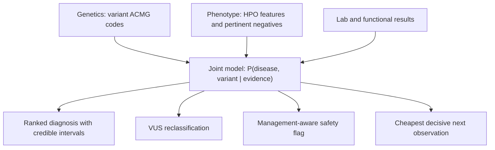

<div align="center">

# DISCERN

**A coupled disease and variant engine for inherited bleeding and platelet disorders:
differential diagnosis, misdiagnosis prevention, and VUS resolution in a single model.**

[](https://github.com/ahmedanees-m/discern/actions/workflows/ci.yml)
[](https://codecov.io/gh/ahmedanees-m/discern)
[](https://www.python.org)
[](https://github.com/astral-sh/ruff)
[](LICENSE)
[](#project-status)
[](tests)

Built on the reused OmniVar Navigator foundation (rule engine, evidence adapters, equity
layer, audit, and infrastructure).

</div>

## Overview

Inherited bleeding disorders are frequently misdiagnosed because distinct diseases
converge on the same clinical picture through shared molecular pathways. The mistakes are
concrete and treatment changing: Glanzmann thrombasthenia versus LAD-III (which needs a
stem-cell transplant); type 2B von Willebrand disease versus platelet-type VWD (opposite
treatments, where DDAVP can harm 2B); Bernard-Soulier mistaken for ITP (leading to
needless steroids or splenectomy); Factor XIII deficiency missed until a fatal brain bleed.
More than 60 percent of variants in these genes are classified as uncertain (VUS), and the
settings that most need disambiguation have the least access to specialist labs.

DISCERN treats diagnosis, misdiagnosis safety, and VUS resolution as three readouts of one
model. It computes a single joint posterior over disease and variant, then reports the
most probable explanation, what would change it, and the cheapest observation that gets
there.

## The core idea

The criterion PP4 ("this phenotype is specific for one disease") structurally requires a
disease model. Generic variant classifiers cannot compute it properly because they do not
model the disease. DISCERN can, because the disease-discrimination model is exactly what
PP4 needs. So the disease-reasoning layer is also a VUS-resolution engine: the same
phenotype that ranks the diagnosis supplies a calibrated PP4, and the same test that
separates two diseases usually supplies the functional evidence that upgrades the variant.

## What makes it novel

| Contribution | Description |
|---|---|
| Coupled joint model | One posterior `P(D, V given E)`: phenotype informs the disease, variant-intrinsic genetics inform the variant, functional evidence informs both. PP4 is expressed as the disease-to-variant coupling, not as an added code. |
| VCEP anchored, counted once | Each ACMG code is routed to exactly one factor. The ClinGen VCEP specification is decomposed per code rather than consumed as a bottom-line label, so no evidence is double counted. A reconstruction test verifies this. |
| Management-aware safety flag | Fires on treatment danger, not on the size of the posterior gap. A small probability of a treatment-changing competitor fires (DDAVP and 2B, splenectomy and BSS, HSCT and LAD-III). |
| Cheapest decisive next observation | Ranks lab, functional, segregation, and phasing steps by information gain over the joint posterior, and works on partial inputs. |
| Calibrated abstention | Sparse likelihood ratios produce wide credible intervals, so the engine declines to call when the data cannot support it. The headline safety metric is the confident-and-wrong rate. |

## How it works



Each evidence stream enters the model exactly once. The cluster is small, so the joint is
computed by exact enumeration over disease and variant states. When the data are sparse,
the engine abstains and returns the deciding observation instead.

## The discrimination clusters (the cited C1-C10 catalog)

| Cluster | Look-alike diseases | Deciding observation | Misdiagnosis harm |
|---|---|---|---|
| Integrin (C1) | Glanzmann, LAD-III, RASGRP2, LAD-I | leukocytosis, integrin activation | LAD-III and LAD-I need HSCT |
| VWF and GPIb (C2) | 2B VWD, platelet-type VWD, 2A VWD | RIPA mixing (plasma vs platelet) | DDAVP harms 2B; opposite treatment |
| Thrombocytopenia + leukaemia risk vs ITP (C4) | RUNX1, ETV6, ANKRD26 vs ITP | germline panel, pedigree, platelet size | missed leukaemia surveillance; avoid splenectomy/immunosuppression; affected relative not a donor |
| Macrothrombocytopenia vs ITP (C3) | Bernard-Soulier, MYH9 vs ITP | blood smear, CD42 flow | avoids steroids and splenectomy |
| 2N VWD vs mild hemophilia A (C5) | VWD 2N, mild/moderate hemophilia A | VWF:FVIII-binding assay | inheritance counselling; VWF-containing vs FVIII |
| Coagulation factor incl. FXIII (C8) | F8, F9, F11, F13A1/F13B, fibrinogen | factor assays, FXIII activity | recombinant FXIII-A2 works for F13A1 not F13B; FXIII miss risks brain bleed |
| Granule / storage pool (C6) | HPS, Chediak-Higashi, delta-SPD | EM, smear, HLH workup | Chediak risks HLH (HSCT) |
| Alpha-granule (C7) | Gray platelet (NBEAL2), GFI1B, ARC, Quebec | smear, EM, urokinase assay | GPS myelofibrosis surveillance; Quebec needs antifibrinolytics not platelets |
| Mild bleeding / low VWF (C9) | type-1 / low VWF, mild platelet defect, normal | repeat VWF, LTA, BAT score | over-/under-diagnosis (calibration/abstention demo) |
| Scott syndrome (C10) | Scott (ANO6) vs normal workup | PS-exposure / prothrombinase assay | easily missed (routine tests normal) |

Every likelihood ratio is linked to a source PMID and a sample size (a CI guard enforces this),
so the knowledge base is versioned and citable.

## Inputs and outputs

Input: a variant (gene plus applied ACMG codes), clinical features (HPO terms, present and
explicitly absent), and lab or functional results. Any subset is accepted (partial-input
mode).

Output (`DxRecommendation`): a ranked diagnosis with credible intervals, the measured VUS
reclassification, management-aware safety flags, the cheapest decisive next observation, a
templated explanation, and a full audit trail.

Worked examples (actual engine output):

* Glanzmann vs LAD-III, ITGB3 VUS with recurrent infections. Leading: LAD-III at 73 percent
  (95 percent CI 55 to 91). Flag: if Glanzmann instead, management changes from HSCT to
  antifibrinolytics. Cheapest next step: white cell count for leukocytosis.
* 2B vs platelet-type VWD, GP1BA with platelet-origin RIPA and planned DDAVP. Leading:
  platelet-type VWD at 84 percent. Hard stop: DDAVP is contraindicated if type 2B
  (probability 0.14); resolve first. Cheapest next step: targeted GP1BA versus VWF
  sequencing.

## Quick start

```bash
conda env create -f environment.yml        # or: pip install -e ".[dev]"
make test                                   # ruff and pytest (107 tests)
```

```python
from jointdx.factorgraph import Evidence
from jointdx.orchestrate import diagnose
from core.dx_schemas import Feature, FeatureKind

ev = Evidence(variant_gene="GP1BA",
              clinical=[Feature("ripa_mixing_platelet_origin", FeatureKind.LAB, True)])
rec = diagnose(ev, planned_tx="ddavp")
print(rec.posterior.leading, rec.explanation)   # platelet-type VWD plus a DDAVP hard stop
```

API: `POST /diagnose` (FastAPI). Deploy on the VM with
`docker compose -f deploy/compose.vm.yml up -d`.

## Repository structure

```
core/         shared schemas plus the DISCERN data model (dx_schemas.py)
rules/        ACMG point engine, posterior bridge, code parser
rules/vcep/   machine-readable VCEP specs plus the per-code partition map
adapters/     gnomAD, ClinVar, in-silico, splice, autoPVS1, MAVE, phenotype, prioritizer
evidence/     genetic (variant-intrinsic), phenotype LR with negatives, lab and functional
diseases/     disease ontology and the six discrimination clusters (clusters/*.yaml)
jointdx/      the joint model: factorgraph, infer, uncertainty, abstain, orchestrate, explain
safety/       management-aware misdiagnosis and treatment-safety interlock
nextobs/      cheapest decisive next observation, partial-input mode, what-if
triage/       scientist-facing VUS triage (which variant to assay next)
intake/       free-text to HPO with pertinent-negative capture
equity/       ancestry reliability, equitable routing, dashboards
learn/        outcome store and auditable prior updates
sim/  eval/   simulator; validation harnesses (ERepo reconstruction, Phenopacket benchmark,
              VUS reclass, misdiagnosis rescue, reader study, calibration)
llm/  api/    cloud Nemotron gateway and the FastAPI engine endpoints
deploy/ docker/ data/ figures/ tests/   deployment, container images, data scripts, tests
```

## Validation status

Real-data results (Tier A, open data; see `docs/DISCERN_Validation_Results.md`):

* ACMG combining-rule fidelity on the real ClinGen Evidence Repository: on 2,653 real
  VCEP-classified bleeding-gene variants, the Tavtigian point engine reproduces the VCEP's
  bottom-line label from the experts' own applied codes at 93.0 percent exact and 100
  percent within-one-bin. This validates the point values and banding, not code assignment
  (the codes are given) and not the disease-variant coupling (no phenotype is present here).
* Per-code partition on the same variants (the no-double-counting evidence): every applied
  code is routed to exactly one factor (0 unknown); codes owned by non-genetic factors
  (PP4/PS3/PP1/PM3 and so on) appear in 31.7 percent of variants and are routed out of the
  genetic stream (1,443 PP4 points to the coupling, 393 functional, 794 segregation/phasing).
  A tool consuming the bottom-line label would double-count these; on real variants this
  would over-classify 549 of 2,653. The coupling itself is unit-tested; its empirical
  validation awaits the paired-phenotype cohorts.
* Diagnosis benchmark on the open GA4GH Phenopacket Store: the general corpus is thin on
  inherited bleeding disorders, yielding 4 in-cluster cases (LAD-III, Chediak-Higashi);
  DISCERN is correct on all 4 (Top-1). The diagnosis-accuracy headline needs curated cases
  and the cohorts below.
* Genome-wide partition generalization (v3.1): across the full ClinGen Evidence Repository
  (12,240 variants, 170 genes), the per-code partition covers 100 percent of applied codes
  (0 unknown), and a naive all-codes score would over-classify 33.2 percent of variants
  (95 percent CI 32.4 to 34.1) - higher than the bleeding-panel figure, so the no-double-count
  value grows genome-wide. ClinVar concordance of the intrinsic-only band: 62.4 percent exact,
  92.8 percent within-one-bin (intrinsic-only is a designed lower bound, omitting routed codes).
* Variant calibration (v3.1): isotonic calibration against ClinVar labels (7,521 variants)
  gives expected calibration error 0.008 and Brier 0.0073 (from 0.201 and 0.060 uncalibrated).
* Curated published-case diagnosis (v3.1, small n): Top-1 80 percent, Top-3 100 percent on 10
  cited cases across clusters; the two non-Top-1 cases are the shared-feature pairs that need
  the deciding genetic/binding test. Cohort-scale accuracy is gated below.
* Gate G1: the reused rule engine reproduces ClinGen eRepo at 94.9 percent exact and 99.9
  percent within-one-bin concordance on 12,499 records.

Pending external access (harnesses built, run when access clears): the gold-standard
BRIDGE-BPD cohort (EGA EGAS00001001172) and an 80-patient ITP misdiagnosis cohort via the
NIHR BioResource DAC, and a South Indian Glanzmann cohort under local IRB. The full
protocol and the reader study are pre-registered on OSF before those analyses.

## Safety

DISCERN abstains when sparse likelihood ratios cannot support a call, reports the
confident-and-wrong rate, and never auto-diagnoses or auto-treats. It recommends, with
human sign-off and a full audit trail. No real patient data appears in any public artifact.

## Project status

DISCERN phases 0 through 10 are code complete and unit tested on the reused OmniVar
foundation. The per-code VCEP frequency criteria (BA1/BS1/PM2) and the PM2 Supporting
strength were extracted and verified for the ITGA2B/ITGB3, F8, F9, VWF, and GP1BA specs
from the ClinGen CSpec registry and the panels' own Evidence Repository records (see
docs/DISCERN_VCEP_Spec_Verification_Report.md); the remaining in-specification item is the
variant-dependent PVS1 and PS4 strength decision trees, kept at ACMG baseline as a
documented simplification. The v3.1 expansion adds genome-wide partition validation, ClinVar
concordance, variant calibration, novel-variant scoring, the full C1-C10 cluster catalog with a
per-cluster safety map, Mondrian conformal selective prediction, and a pre-registered coupling
protocol. The novel coupling itself remains cohort-gated and is never claimed before paired-data
results (Gate G13). Remaining external work: the DAC/IRB cohorts, the reader study, the
gnomAD per-variant cross-check, and the web interface. See
[docs/DISCERN_Execution_Summary_v3.1.md](docs/DISCERN_Execution_Summary_v3.1.md) and
[docs/DISCERN_v3.1_Claims_Map.md](docs/DISCERN_v3.1_Claims_Map.md) for the full status.

## License and citation

Released under the [MIT License](LICENSE). Reference datasets retain their upstream
licenses. Cite via [CITATION.cff](CITATION.cff). All sources were independently verified;
see [docs/DISCERN_Source_Verification_Report.md](docs/DISCERN_Source_Verification_Report.md).

Author: Anees Ahmed Mahaboob Ali ([@ahmedanees-m](https://github.com/ahmedanees-m)).
